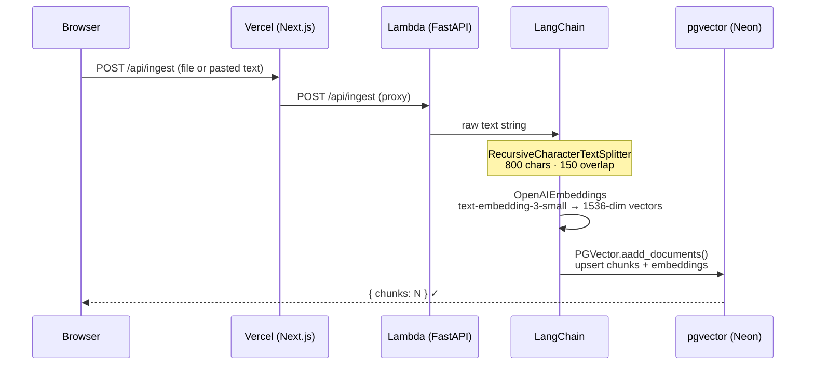
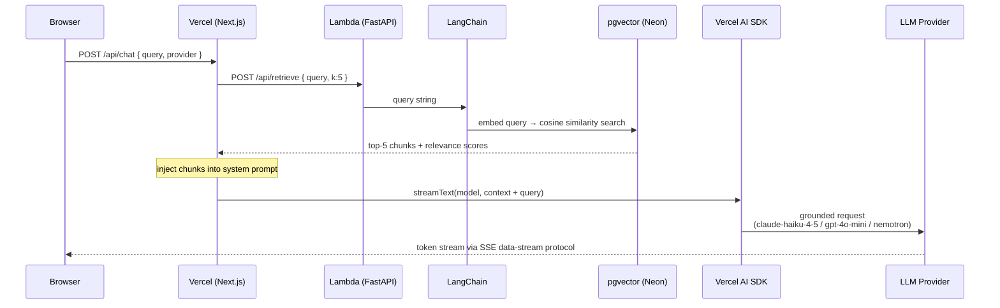

# RAG + pgvector Demo — LangChain · Vercel AI SDK · NVIDIA NIM

End-to-end **Retrieval-Augmented Generation pipeline** over any unstructured corpus: LangChain chunking,
OpenAI embeddings stored in **pgvector**, cosine-similarity retrieval, and token-level SSE streaming via
**Vercel AI SDK**. Provider toggle switches between Anthropic, OpenAI, and **NVIDIA NIM (Nemotron)** at
runtime — same interface, configurable `base_url`.

Sister repo: [agent-orchestration-demo](https://github.com/bganguly/agent-orchestration-demo)

---

## Running

```bash
./scripts/deploy.sh      # local [1], AWS Lambda + Neon + Vercel [2], or GCP Cloud Run [3]
./scripts/infra-down.sh  # tear down local [1] or AWS [--aws] or GCP [--cloud]
```

### Cost — serverless, scales to zero

| Resource | Provider | Cost |
|---|---|---|
| **Backend** | AWS Lambda (container image, 1 GB) | ~$0 (free tier) |
| **Database** | Neon serverless Postgres + pgvector | ~$0 (free tier, 512 MB) |
| **Frontend** | Vercel | ~$0 (free tier) |
| **Total** | | **~$0/mo** |

Lambda and Neon both scale to zero between requests — no idle charges, no scheduled start/stop needed.

---

| Component | Implementation |
|---|---|
| **RAG pipeline** | LangChain `RecursiveCharacterTextSplitter` (800 chars / 150 overlap) → OpenAI `text-embedding-3-small` (1 536 dims) → pgvector cosine similarity |
| **Vector store** | PostgreSQL 16 + pgvector extension; `langchain-postgres` `PGVector` handles schema, IVFFlat index, and async upsert |
| **LLM streaming** | Next.js App Router API route calls FastAPI `/api/retrieve`, injects chunks as context, then streams via Vercel AI SDK `streamText`; tokens arrive at the browser via the AI SDK data-stream protocol |
| **Provider toggle** | Anthropic `claude-haiku-4-5` (default) · OpenAI `gpt-4o-mini` · NVIDIA NIM `nvidia/llama-3.3-nemotron-super-49b-v1` — switched from the header without reloading |
| **Ingest API** | `POST /api/ingest` accepts `.txt` / `.md` file upload or raw pasted text; chunked and embedded in one call |
| **Backend** | FastAPI 0.115 + asyncio; `lifespan` hook initialises pgvector extension and LangChain collection on startup; served via **Mangum** on AWS Lambda |
| **Frontend** | Next.js 15 App Router, React 19, TypeScript 5.7, Tailwind CSS; `useChat` from `ai/react`; deployed on **Vercel** |
| **IaC** | Terraform (`infra/aws/`) — Lambda, ECR, CodeBuild, S3, IAM, CloudWatch |

---

## Architecture

### Ingest flow



### Chat / query flow



### What LangChain replaces

| Component | Without LangChain | Why it matters |
|:--|:--|:-------------------------------------|
| `RecursiveCharacterTextSplitter` | Manual regex split + overlap bookkeeping | Overlap prevents semantic units being cut at chunk boundaries — retrieval precision drops without it |
| `OpenAIEmbeddings` | Raw `openai.embeddings.create()` + batching | Guarantees same model ID at ingest and query time — a mismatch silently breaks cosine scores |
| `PGVector.aadd_documents()` | `CREATE TABLE`, `CREATE INDEX`, parameterised `INSERT` per chunk | Schema + IVFFlat index provisioned automatically on startup; no migrations to write |
| `PGVector.similarity_search_with_relevance_scores()` | Embed query → `SELECT … ORDER BY embedding <=> $1 LIMIT k` | One call returns typed `(Document, float)` tuples that map directly to the API response |

### Key design decisions

| Concern | Approach |
|---|---|
| **Retrieval** | pgvector IVFFlat cosine index; top-k chunks injected into the LLM system prompt at request time |
| **Streaming** | Next.js API route proxies Lambda retrieve call, then calls `streamText`; the AI SDK data-stream protocol delivers deltas directly to `useChat` — no polling |
| **Provider abstraction** | `pickModel()` in `app/api/chat/route.ts` returns the SDK model object; the rest of the route is provider-agnostic |
| **Embeddings** | Always OpenAI `text-embedding-3-small` regardless of LLM provider toggle — Anthropic has no embeddings API |
| **Lambda cold start** | Mangum wraps FastAPI; `lifespan` hook runs `init_db()` on cold start; asyncpg pool uses `max_inactive_connection_lifetime=30` to handle Neon's auto-pause reconnection |
| **No LLM response cache** | Same prompt + updated KB should return a different answer as documents change |

---

## Live Service

| | URL |
|---|---|
| **App** | https://d21n92v3nexm0p.cloudfront.net |
| **API docs** | https://d21n92v3nexm0p.cloudfront.net/api/docs |

```bash
BASE=http://localhost:8001

curl "$BASE/health"

curl -X POST "$BASE/api/ingest" \
  -F "text=The Federal Reserve sets interest rates to control inflation." \
  -F "source=test"

curl -X POST "$BASE/api/retrieve" \
  -H "Content-Type: application/json" \
  -d '{"query": "How does the Fed control inflation?", "k": 3}' | jq '.chunks[].score'
```

---

## Using the App

1. **Select topics** — toggle the Wikipedia topic chips in the left panel.
2. **Choose depth** — **Summary** (default, ~1–2 chunks/topic, instant) or **Full Article** (~50–150 chunks/topic, ~$0.01 total OpenAI embedding cost).
3. **Click Load Selected** — fetches, chunks, embeds, and stores; per-topic progress shows estimated chunks and elapsed seconds.
4. **Ask a question** — pick from the **Sample questions** strip above the input, or type your own and press **Ask**.
5. **Switch provider** — use the Anthropic / OpenAI / NVIDIA NIM toggle in the header at any time.
6. **Custom documents** *(optional)* — expand **Custom Documents** to paste text or upload a `.txt` / `.md` file.

---

## Prerequisites for AWS deploy

- AWS CLI configured (`aws configure`)
- Terraform >= 1.5
- Vercel CLI (`npm install -g vercel`) and logged in (`vercel login`)
- A [Neon](https://neon.tech) free account — create a project, enable the `pgvector` extension, copy the connection string
