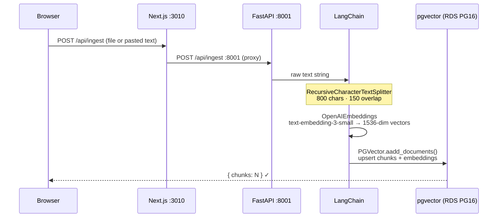
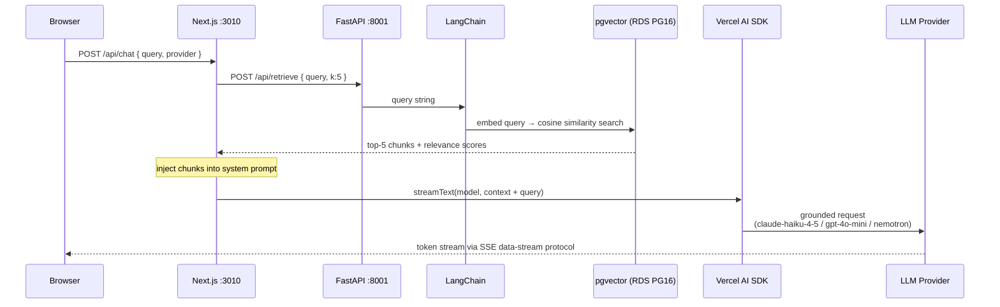

# RAG + pgvector Demo — LangChain · Vercel AI SDK · NVIDIA NIM

End-to-end **Retrieval-Augmented Generation pipeline** over any unstructured corpus: LangChain chunking,
OpenAI embeddings stored in **pgvector**, cosine-similarity retrieval, and token-level SSE streaming via
**Vercel AI SDK**. Provider toggle switches between Anthropic, OpenAI, and **NVIDIA NIM (Nemotron)** at
runtime — same interface, configurable `base_url`.

Sister repo: [agent-orchestration-demo](https://github.com/bganguly/agent-orchestration-demo)

---

| | |
|---|---|
| **RAG pipeline** | LangChain `RecursiveCharacterTextSplitter` (800 chars / 150 overlap) → OpenAI `text-embedding-3-small` (1 536 dims) → pgvector cosine similarity |
| **Vector store** | PostgreSQL 16 + pgvector extension; `langchain-postgres` `PGVector` handles schema, IVFFlat index, and async upsert |
| **LLM streaming** | Next.js App Router API route calls FastAPI `/api/retrieve`, injects chunks as context, then streams via Vercel AI SDK `streamText`; tokens arrive at the browser via the AI SDK data-stream protocol |
| **Provider toggle** | Anthropic `claude-haiku-4-5` (default) · OpenAI `gpt-4o-mini` · NVIDIA NIM `nvidia/llama-3.3-nemotron-super-49b-v1` — switched from the header without reloading |
| **Ingest API** | `POST /api/ingest` accepts `.txt` / `.md` file upload or raw pasted text; chunked and embedded in one call |
| **Backend** | FastAPI 0.115 + asyncio; `lifespan` hook initialises pgvector extension and LangChain collection on startup |
| **Frontend** | Next.js 15 App Router, React 19, TypeScript 5.7, Tailwind CSS; `useChat` from `ai/react` |
| **IaC** | Terraform (`infra/aws/`) — VPC, subnets, security groups, RDS, ECS cluster, ALB, ECR, CodeBuild, EventBridge schedules |

---

## Architecture

**Interactive component flow diagram:** [RAG Pipeline — Component Flow](https://claude.ai/code/artifact/68435554-f15d-437c-9cff-db62bf578b1e)

### Ingest flow



### Chat / query flow



### What LangChain replaces

| Component | Without LangChain | Why it matters |
|---|---|---|
| `RecursiveCharacterTextSplitter` | Manual regex split + overlap bookkeeping | Overlap prevents semantic units being cut at chunk boundaries — retrieval precision drops without it |
| `OpenAIEmbeddings` | Raw `openai.embeddings.create()` + batching | Guarantees same model ID at ingest and query time — a mismatch silently breaks cosine scores |
| `PGVector.aadd_documents()` | `CREATE TABLE`, `CREATE INDEX`, parameterised `INSERT` per chunk | Schema + IVFFlat index provisioned automatically on startup; no migrations to write |
| `PGVector.similarity_search_with_relevance_scores()` | Embed query → `SELECT … ORDER BY embedding <=> $1 LIMIT k` | One call returns typed `(Document, float)` tuples that map directly to the API response |

### Key design decisions

| Concern | Approach |
|---|---|
| **Retrieval** | pgvector IVFFlat cosine index; top-k chunks injected into the LLM system prompt at request time |
| **Streaming** | Next.js API route proxies FastAPI retrieve call, then calls `streamText`; the AI SDK data-stream protocol delivers deltas directly to `useChat` — no polling |
| **Provider abstraction** | `pickModel()` in `app/api/chat/route.ts` returns the SDK model object; the rest of the route is provider-agnostic |
| **No LLM response cache** | Same prompt + updated KB should return a different answer as documents change; caching the retrieval step (not implemented) would be safe |
| **No Docker locally** | Homebrew PostgreSQL + pgvector + Python venv + `npm dev` — `local-dev.sh` wires everything without containers |

---

## Running

```bash
./scripts/deploy.sh      # local [1], AWS ECS Fargate [2], or GCP Cloud Run [3]
./scripts/infra-down.sh  # tear down local [1] or AWS [--aws] or GCP [--cloud]
```

### Cost control — scheduled 8am–5pm Pacific window (weekdays)

ECS tasks start/stop on a weekday schedule managed by EventBridge Scheduler. RDS runs 24/7 — stopping it flushes the buffer pool, making the first retrieval of every morning slower.

| Resource | Scale-up | Scale-down | ~$/mo |
|---|---|---|---|
| **ECS Fargate — frontend** (0.25 vCPU / 0.5 GB) | 8am PT Mon–Fri | 5pm PT Mon–Fri | ~$2 |
| **ECS Fargate — backend** (0.5 vCPU / 1 GB) | 8am PT Mon–Fri | 5pm PT Mon–Fri | ~$4 |
| **RDS db.t3.micro** + 20 GB storage | always-on | always-on | ~$14 |
| **ALB** | always-on | always-on | ~$18 |
| **Total** | | | **~$38–50/mo** |

`./scripts/deploy.sh` shows an interactive prompt at the top of every remote run:

```
  Backend:  ACTIVE desired=1   Frontend: ACTIVE desired=1
  Auto-schedule: 8 am start · 5 pm stop · weekdays PT · state=ENABLED
  [1] Start now  [2] Stop now  [3] Suspend schedule  [4] Resume schedule  [enter] Full deploy:
```

---

## Live Service

| | URL |
|---|---|
| **App** | https://d21n92v3nexm0p.cloudfront.net |
| **API docs** | https://d21n92v3nexm0p.cloudfront.net/api/docs |

```bash
BASE=http://localhost:8001

curl "$BASE/health"

curl -X POST "$BASE/api/ingest" \
  -F "text=The Federal Reserve sets interest rates to control inflation." \
  -F "source=test"

curl -X POST "$BASE/api/retrieve" \
  -H "Content-Type: application/json" \
  -d '{"query": "How does the Fed control inflation?", "k": 3}' | jq '.chunks[].score'
```

---

## Local Dev (no Docker)

### Prerequisites

```bash
brew install postgresql@16 pgvector node python@3.12
brew services start postgresql@16
```

### Start

```bash
cp .env.example .env   # fill in OPENAI_API_KEY (required); ANTHROPIC_API_KEY and NVIDIA_API_KEY optional
./scripts/local-dev.sh
./scripts/local-dev.sh --seed   # also loads Wikipedia articles on first run
```

| | |
|---|---|
| App | http://localhost:3010 |
| FastAPI docs | http://localhost:8001/docs |

The script creates the `ragdb` database, enables the `vector` extension, sets up the Python venv, and starts both services.

---

## Using the App

1. **Select topics** — toggle the Wikipedia topic chips in the left panel, then click **Load Selected** to fetch, chunk, embed, and store them.
2. **Ask a question** — pick from the **Sample questions** strip above the input, or type your own and press **Ask**.
3. **Switch provider** — use the Anthropic / OpenAI / NVIDIA NIM toggle in the header at any time.
4. **Custom documents** *(optional)* — expand **Custom Documents** to paste text or upload a `.txt` / `.md` file.
